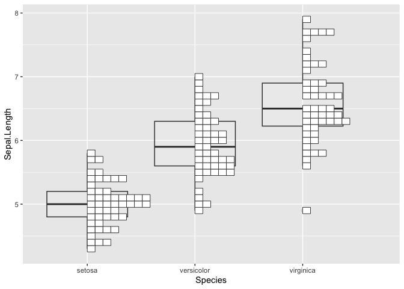

Chart Gallery
================
Ko ABE
2024-02-07

## Plots

``` r
library(ggbrick)
```

    ## Loading required package: ggplot2

``` r
ggplot(data = iris) +
  geom_brick(aes(y = Sepal.Length, x=Species), binwidth = 0.1)
```

<!-- -->

``` r
ggplot(data = iris) +
  geom_brick(aes(y = Sepal.Length, x=Species), binwidth = 0.5)
```

<!-- -->

``` r
ggplot(data = iris) +
  geom_brick(aes(y = Sepal.Length, x=Species), binwidth = 0.5, fill = "grey30")
```

<!-- -->

``` r
ggplot(data = mpg,aes(y = cty, x=factor(year), fill=factor(cyl))) +
  geom_brick(binwidth = 1)
```

<!-- -->

``` r
ggplot(data = mpg,aes(y = cty, x=factor(year), fill=factor(cyl))) +
  geom_brick(binwidth = 1, stackgroups = FALSE, alpha = 0.5)
```

<!-- -->

``` r
ggplot(data = mpg,aes(y = cty, x=factor(year), fill=factor(cyl))) +
  geom_brick(binwidth = 1, stackgroups = FALSE, alpha = 0.5,
             stackdir = "centerwhole", position = position_dodge(0.5))
```

<!-- -->

``` r
ggplot(data = diamonds, aes(x = color, y=carat, colour=cut)) +
  geom_brick(binwidth=0.2) +
  coord_flip()
```

<!-- -->

``` r
ggplot(data = iris ,aes(y = Sepal.Length, x=Species)) +
  geom_brick(binwidth = 0.1)+
  stat_summary(fun = median, fun.min = median, fun.max = median,
               geom = "crossbar")
```

<!-- -->

``` r
ggplot(data = iris,aes(y = Sepal.Length, x=Species)) +
  geom_boxplot(alpha=0.1)+
  geom_brick(binwidth = 0.1)
```

<!-- -->
